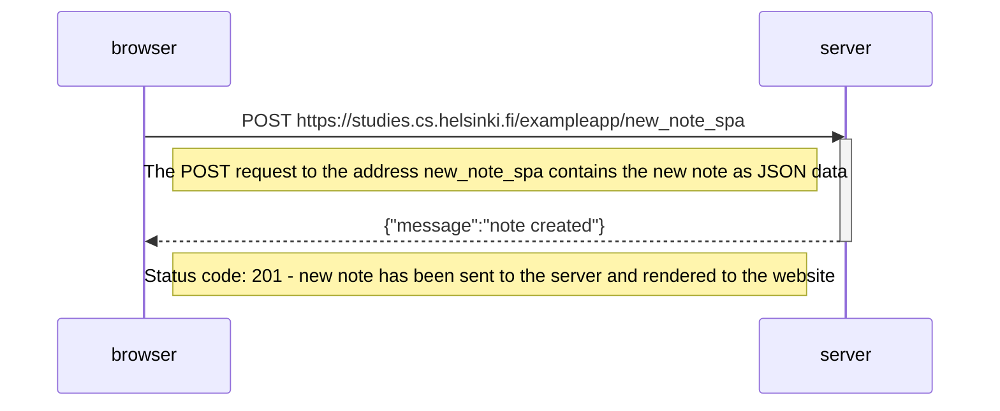

```mermaid
sequenceDiagram
    participant browser
    participant server

    browser->>server: POST https://studies.cs.helsinki.fi/exampleapp/new_note_spa
    activate server

    Note left of server: The POST request to the address new_note_spa contains the new note as JSON data

    server-->>browser: {"message":"note created"}
    deactivate server

    Note right of browser: Status code: 201 - new note has been sent to the server and rendered to the website
```
